= HEBI Charts

HEBI Charts is a 2D and 3D visualization library designed for low-overhead rendering of high-speed telemetry with a focus on the robotics domain. It features a stable C ABI supporting Linux, macOS, and Windows, with idiomatic bindings for Python, MATLAB, and C++.

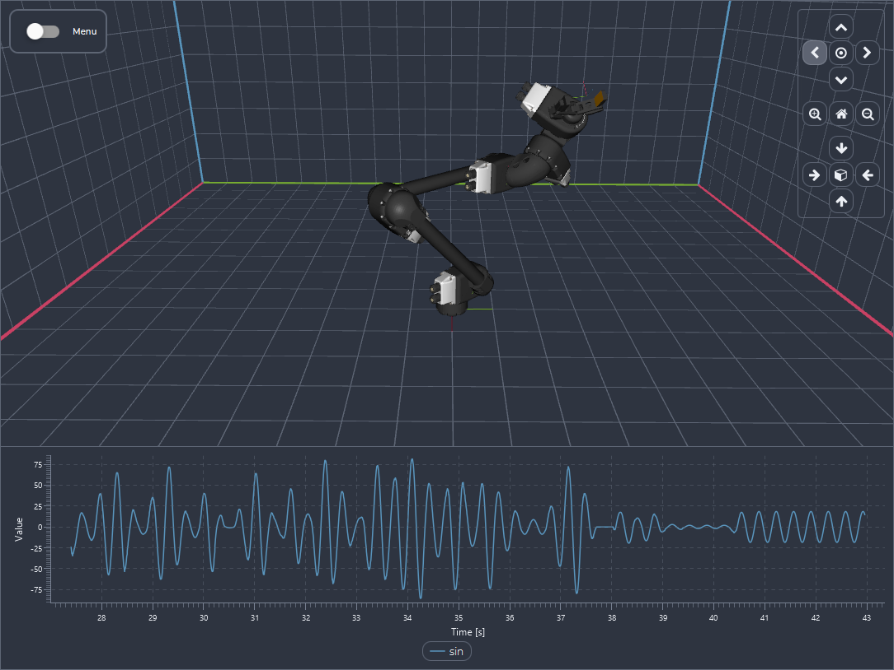

[source,mermaid]
----
graph TD

    PY_C[<b>Python</b>]
    ML_C[<b>MATLAB</b>]
    CPP_C[<b>C++</b>]

    PY_W["<b>Python Module</b> Classes, Enums, Hints"]
    ML_W["<b>MATLAB Toolbox</b> Classdef, Hints"]
    CPP_W["<b>C++ Header</b> CMake, OOP / RAII"]

    P11[ctypes FFI]
    MEX[MEX Gateway]
    LINK[Direct Link]

    ABI["<b>Stable C ABI</b> Shared Binary (.dll / .so)"]

    %% Flow
    PY_C --> PY_W --> P11 --> ABI
    ML_C --> ML_W --> MEX --> ABI
    CPP_C --> CPP_W --> LINK --> ABI

    %% Styling
    style ABI fill:#fff3e0,stroke:#333,stroke-width:2px
    style ML_W fill:#e1f5fe,stroke:#01579b
    style PY_W fill:#e1f5fe,stroke:#01579b
    style CPP_W fill:#e1f5fe,stroke:#01579b
----

While HEBI Charts integrates seamlessly with other https://www.hebirobotics.com/[HEBI Robotics] https://docs.hebi.us/tools.html[APIs], it is a fully standalone, zero-dependency library. It accepts raw numerical inputs, making it entirely hardware-agnostic and ready to use with any custom actuator, sensor, or data source.

**Performance through Isolation**

Unlike traditional visualization libraries, HEBI Charts fully decouples data ingestion from the UI thread. Telemetry is pushed into internal buffers that update the UI state at the start of every frame. This isolation allows for MHz-rate updates without stuttering the 60 FPS rendering or requiring manual UI flushes.

[source,mermaid]
----
graph LR
    subgraph Application [<b>User Application</b>]
        UserLoop["<b>Control Loop</b> 1 MHz"]
    end

    subgraph Renderer [<b>Shared Library</b>]
        DoubleBuffer["<b>Data Buffers</b>"]
        RenderLoop["<b>Render Loop</b> 60 FPS"]
    end

    UserLoop -- "Push Data" --> DoubleBuffer
    UserLoop -- "Poll State" --> DoubleBuffer
    DoubleBuffer -- "Frame Sync" --> RenderLoop

    style Application fill:#e1f5fe,stroke:#01579b
    style Renderer fill:#fff3e0,stroke:#333
----

For MATLAB and Python users this means that they can stream data from a high-speed busy-loop without using `drawnow` or adding artificial pauses to maintain UI responsiveness.

State updates still look immediate, so property accessors like `slider.value += 1` work as expected.

== Installation

HEBI Charts features zero-configuration installation. Using the headers or running any example automatically fetches the correct platform-specific binaries and stores them in a shared system cache. Dedicated `pip` and MATLAB package distributions are under active development.

Currently, the target system must support local rendering and hardware GPU acceleration. Software mode and headless rendering support may be added in the future.

.Supported Target Platforms
[cols="1,^1,^1", options="header"]

|====
| OS | amd64 / x86_64 | arm64 / aarch64

| Windows
| ✔️
| ❌

| macOS
| ✔️
| ✔️

| Linux
| ✔️
| ❌
|====

== Getting Started

The main entry point is the `GridWindow`, a layout container of equally sized rows and columns. All other display elements are created in a top-down manner. A window can contain various charts, and each chart can have various lines or other elements. All bindings are fully type-hinted and documented to simplify exploration.

Some constructor calls for UI elements may block until the next frame for proper initialization. Subsequent calls are non-blocking. You can find examples in the corresponding subdirectories. For example, a random walk could look like the snippets below,

.Example 01 - Random Walk
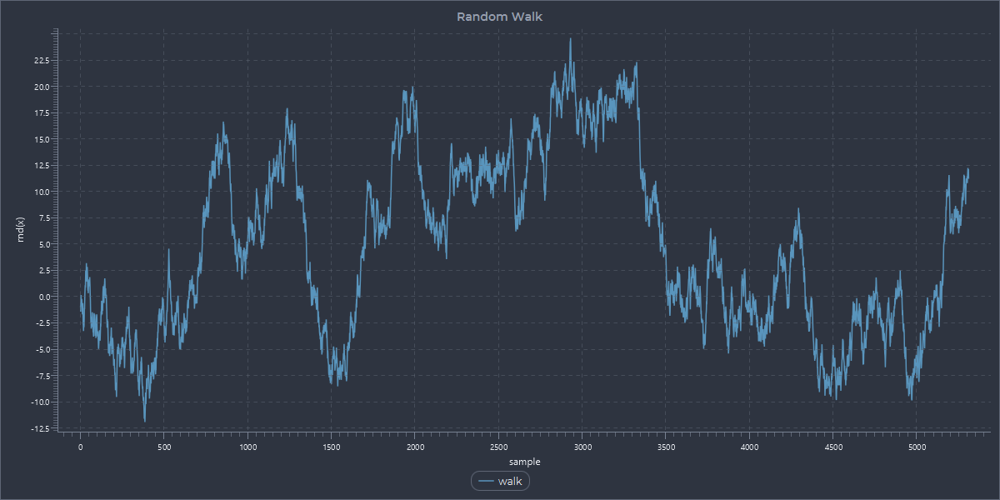

*Python*
[source,python]
----
import time
import random
import hebi_charts

# Build Layout (blocking)
window = hebi_charts.GridWindow(title="Python", size=(800, 600))
chart = window.add_line_chart(title="Random Walk", xlabel="sample", ylabel="rnd(x)")
line = chart.add_line("walk", line_style=hebi_charts.LineStyle.SOLID)

# Live Update
x, y = 0, 0
window.show()
while window.is_showing():
    # reduce the rate (optional)
    time.sleep(0.001)

    # append data (non-blocking)
    x += 1
    y += random.uniform(-1, 1)
    line.add_point(x, y)
----

*MATLAB*
[source,matlab]
----
% Build Layout (blocking)
window = hebi_charts.GridWindow(title='MATLAB', size=[800 600]);
chart = window.addLineChart(title='Random Walk', xlabel='sample', ylabel='rnd(x)');
line = chart.addLine('walk', lineStyle='Solid');

% Live Update
x = 0;
y = 0;
window.show();
while window.isShowing()
    % reduce the rate (optional)
    pause(0.001)

    % append data (non-blocking)
    x = x + 1;
    y = y + (rand() * 2 - 1);
    line.addPoint(x, y);
end
----

*C++*
[source,cpp]
----
#include <chrono>
#include <thread>
#include <cstdlib>

// Build Layout (blocking)
hebi::charts::GridWindow window;
window.setTitle("Cpp");
window.setSize(800, 600);

auto chart = window.addLineChart();
chart.setTitle("Random Walk");
chart.setXLabel("sample");
chart.setYLabel("rnd(x)");

auto line = chart.addLine("walk");
line.setLineStyle(hebi::charts::LineStyle::Solid);

// Live Update
window.show();
double x = 0, y = 0;
while (window.isShowing()) {
    // reduce the rate (optional)
    std::this_thread::sleep_for(std::chrono::milliseconds(1));

    // append data (non-blocking)
    x += 1;
    y += ((double) rand() / RAND_MAX) * 2.0 - 1.0;
    line.addPoint(x, y);
}
----

The window contents can be exported as PNG using `ctrl + c` to copy to clipboard, and `ctrl + s` to save to disk.

== macOS: Starting Cocoa

To satisfy macOS thread requirements, Cocoa needs to own the main thread (id=0) and the user code needs to be run on a background thread. We provide a built-in start function to handle the handover as shown below.

Note that this is not necessary if the library is running inside a GUI application (like MATLAB). On non-macOS platforms, the start function executes the application code directly, making the code portable across all supported systems without manual platform checks.

*Python*

[source,python]
----
import hebi_charts

# run the app on a Cocoa runner
def main():
    # <application logic goes here>
    return

# macOS: let cocoa have the main thread
if __name__ == "__main__":
    hebi_charts.run_application(main)
----

*MATLAB*

Not necessary as MATLAB already starts a Cocoa loop for its own UI.

*C++*

[source,cpp]
----
// Run the app on a Cocoa runner
int application_main(int argc, char **argv) {
    // <application logic goes here>
}

// macOS: let cocoa have the main thread
int main(int argc, char **argv) {
    return hebi::charts::runApplication(application_main, argc, argv);
}
----

== Window Elements

=== LineChart
Standard 2D X/Y Cartesian plot. Supports multiple series and auto-scaling.

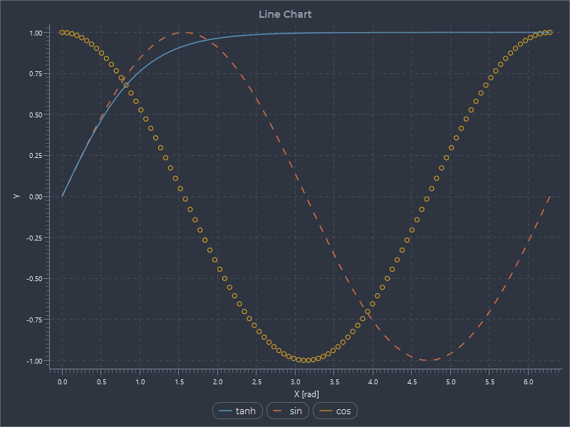

=== Scope
A LineChart with a pre-configured X-axis for monotonically increasing time in seconds.

.Example 02 - Sine Wave
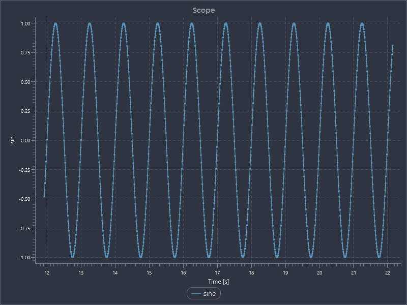

=== PercentileHistogram
Visualizes data distribution using percentiles (e.g., p50, p95, p99).

=== LatencyChart
A PercentileHistogram pre-configured for high-resolution timing data.

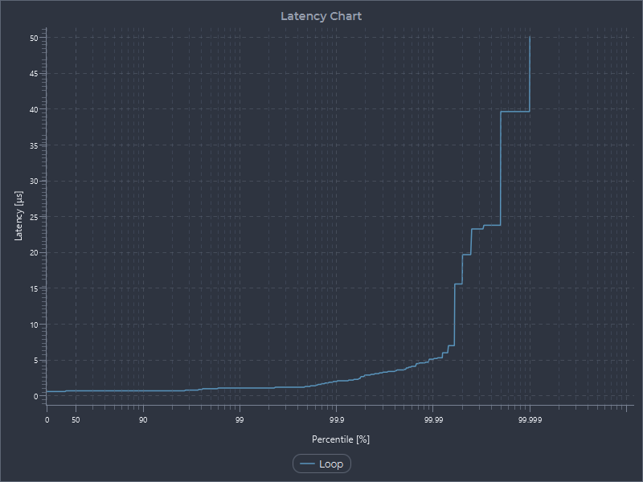

=== StreamView
Low-latency image viewer that reads from shared memory. Requires https://docs.hebi.us/downloads_changelogs.html#software[HEBI Video Acquisition] tools. The format is under active development, so interfaces signatures are subject to refinement in future releases.

=== Scene3d
A 3D coordinate space for rendering meshes and geometric primitives.

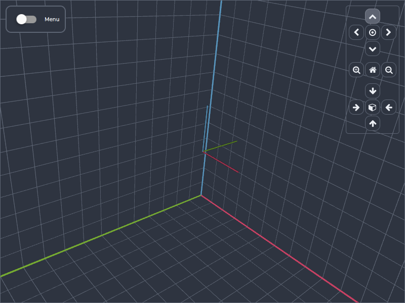

== Scene3D Elements

=== Frame
A coordinate triad showing the X (Red), Y (Green), and Z (Blue) axes.

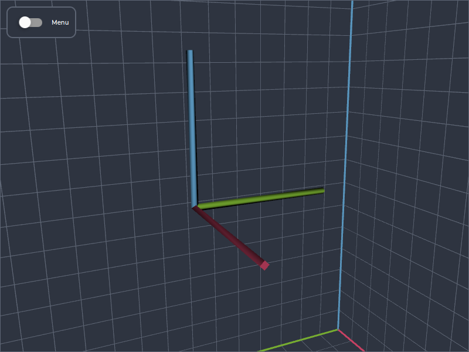

=== Mesh
A 3D object defined by vertices and faces. Meshes support native colors as well as ghosted overlays. We currently only support WaveFront `.obj` files.

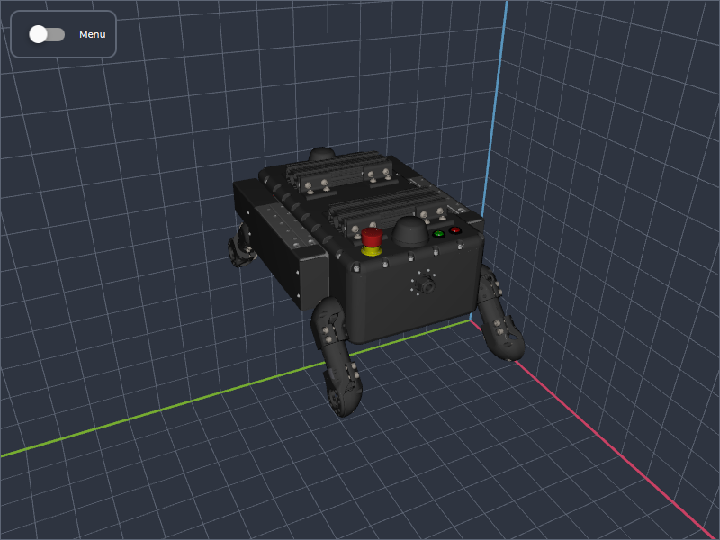

Note that we recommend storing large models on a web server and using URLs instead of storing them in the code repository. URLs to mesh files are cached locally and stored in a pre-parsed binary format, so they can be loaded very efficiently after the initial download.

=== Line3d
A continuous path of connected vertices in 3D space. Note that the current implementation uses dynamic mesh generation with thin triangles, which may have platform differences and gets comparatively expensive for very long lines.

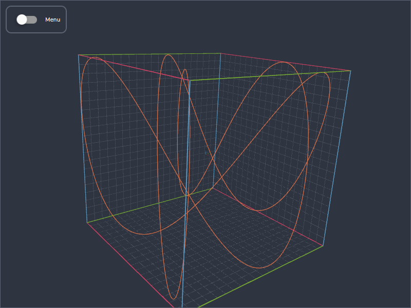

=== Points
A collection of one or more points that get rendered using basic shapes. Note that the current implementation uses dynamic mesh generation and is not suitable for large point clouds.

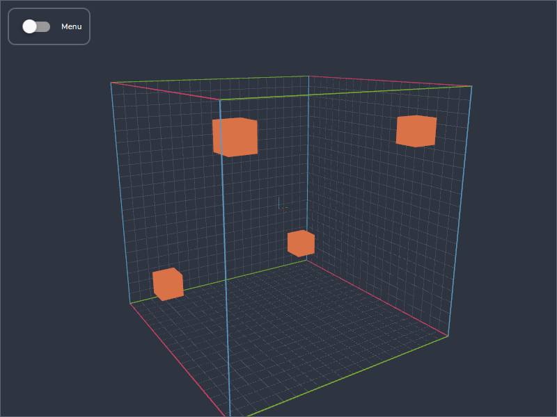

=== Robot
A high-level object that builds a kinematic tree from a description file. Robots support native colors as well as ghosted overlays.

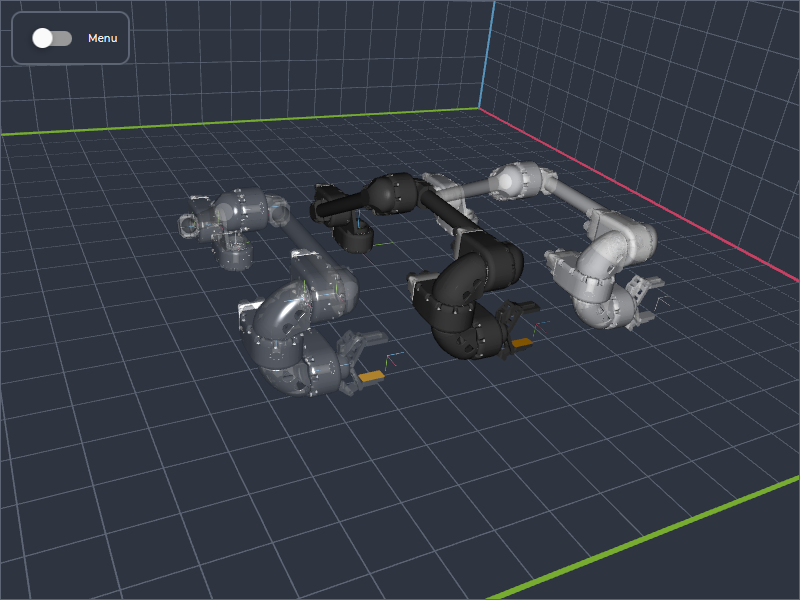

Note that we currently only natively support `.hrdf` files (https://github.com/HebiRobotics/hebi-hrdf[HEBI Robot Description Format]).

The URDF format (Universal Robot Description Format) assumes a ROS installation for the `package://` lookup, which is hard to do cross-platform. We do have experimental tools to convert `.urdf` files to `.hrdf` with relative mesh paths, but  they are too large to bundle with the core library. We may provide separate tooling in the future.

The below screenshot shows a Franka Panda arm imported from a converted URDF:

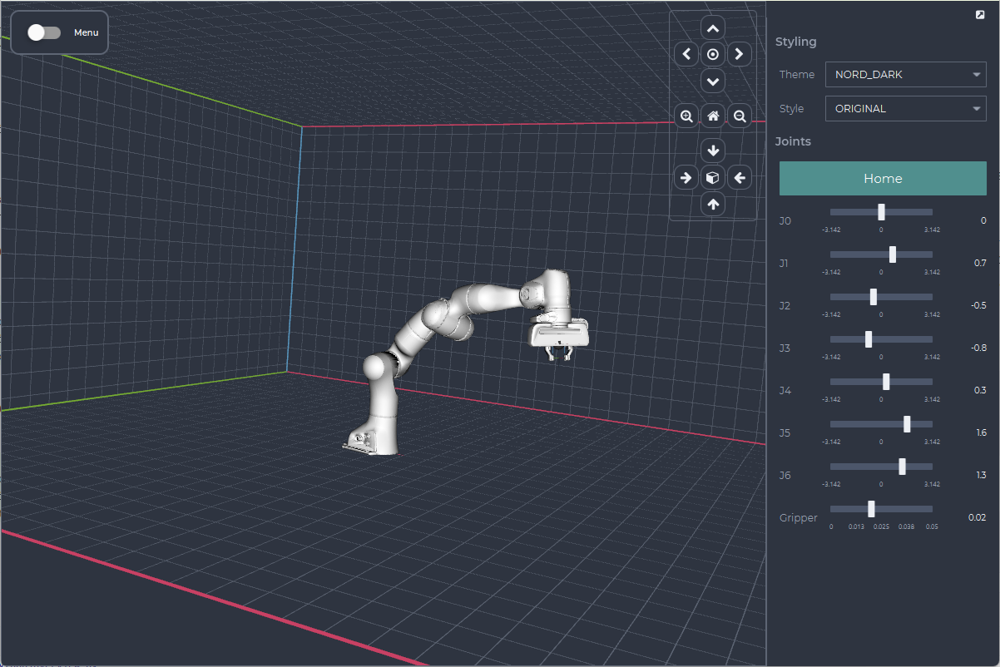

== Controls

The primary goal of this library is passive visualization, but we do provide a basic set of controls to avoid introducing large dependencies for common user input. The controls live in a detachable side panel and are not part of the main grid layout.

The API is purely polling-based to integrate seamlessly with linear control loops. Event checks like `button.was_pressed()` use an atomic read-and-reset mechanism that guarantees that UI events are caught independent of the polling rate.

[source,python]
----
# Create a slider for a control variable
kp = controls.add_slider(label="Kp (Proportional)", limits=(0.0, 100.0), value=5.0)

# Read state in the loop without extra state variables
while True:
    output = kp.value * error
----

This enables simple robot tasks and interactive classroom demos that can focus on the underlying math without dealing with UI framework initialization and asynchronous event callbacks. However, more advanced use cases and complex layouts should be done with actual UI frameworks.

.Example 05 - PID Controller Simulation
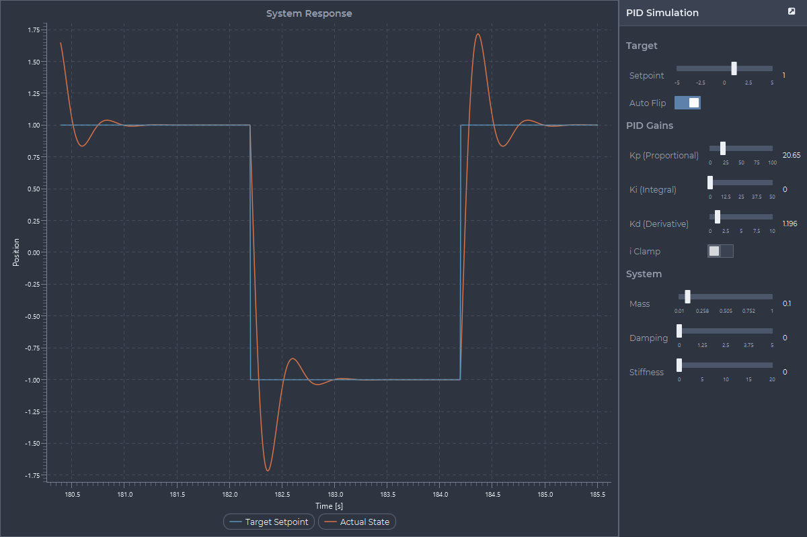

.Example 03 - Robot 3d
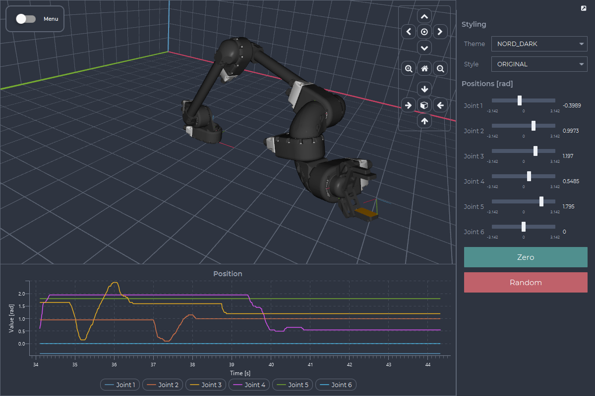

=== Available Controls

[cols="1,4", options="header"]
|===
| Element | Description

| Button
| A clickable trigger that tracks edge transitions. Supports color-coded variants for "Start", "Stop", and generic "Actions".

| Dropdown
| A pick-list for selecting a single text option from a defined set.

| Label
| A read-only text field that supports real-time updates via `text` or `value` properties. Numerical formatting is handled internally on the UI thread in a MATLAB-like format.

| Toggle
| A binary switch (on/off) that maintains state.

| Slider
| A horizontal bar for selecting a numeric value within a defined range.

|===

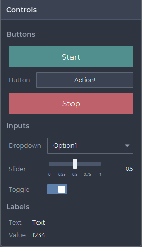

**Python**
[source,python]
----
import hebi_charts

window = hebi_charts.GridWindow(size=(1200, 800))
controls = window.get_control_panel(title="Controls")

controls.add_section("Buttons")
start = controls.add_start_button()
action = controls.add_button(label="Button", text="Action!")
stop = controls.add_stop_button()

controls.add_section("Inputs")
drop = controls.add_dropdown(label="Dropdown", options=["Option1", "Option2"])
slider = controls.add_slider(label="Slider", limits=(0, 1), value=0.5)
toggle = controls.add_toggle(label="Toggle", selected=True)

controls.add_section("Labels")
label_text = controls.add_label(label="Text", text="Text")
label_val = controls.add_label(label="Value", value=1234)

window.show()
while window.is_showing():
    if stop.was_pressed():
        window.close()
----

== LoopTimer

We also provide some non-visual utilities that are often needed when working with control loops. The `LoopTimer` class helps with loop timings and measuring jitter.

On Windows, `LoopTimer` also manages the system timer resolution via `timeBeginPeriod(1)` and `timeEndPeriod()`. This ensures that `sleep` operations use a 1ms resolution rather than the 15.6ms default.

.Example 04 - Latency
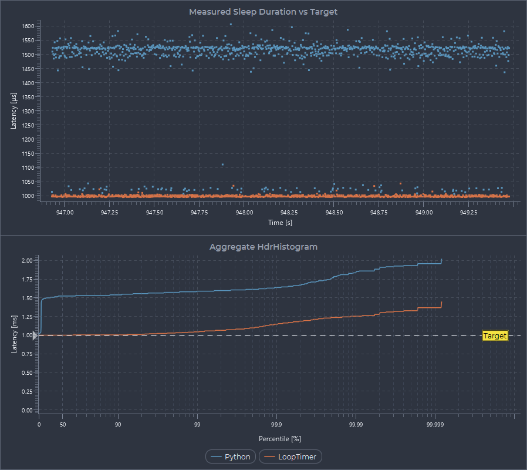

*Running a 1KHz loop (best effort sleep)*
[source,python]
----
import hebi_charts
timer = hebi_charts.LoopTimer(frequency=1000)
while timer.elapsed_time < 10:
    timer.wait_for_next_tick()
----

*Running a 1KHz loop (high accuracy spin)*

The `spin_nanos` method uses a tiered strategy of `sleep > yield > spin` depending on the remaining deadline.

[source,python]
----
import hebi_charts
timer = hebi_charts.LoopTimer(frequency=1000)
while timer.elapsed_time < 10:
    nanos = timer.get_nanos_to_next_tick()
    hebi_charts.LoopTimer.spin_nanos(nanos)
----

*Measuring Time*

`LoopTimer` methods `tic()` and `toc()` measure the time in between an action, and `tic_toc()` atomically returns the time since the last `tic()` and immediately restarts the timer.

[source,python]
----
import hebi_charts
timer = hebi_charts.LoopTimer()
timer.tic()
timer.spin_nanos(1_000_000)
dt_ms = timer.toc() * 1e3
print(f"Elapsed time: {dt_ms:.3f} ms")
----

== HdrHistogram

https://hdrhistogram.github.io/HdrHistogram/[HdrHistogram] is a popular tool in the low-latency community for recording jitter. It uses an efficient high-dynamic-range storage format for recording latencies with long tails.

Besides accepting user-supplied timing values, we also provide built-in timing functionality for consistent access to high-resolution timers (`tic()`, `toc()`), and to reduce the number of hops across the C interface (`tic_toc()`). Recorded values are capped at the (configurable) min and max values to avoid exception handling.

The measurement overhead is very low and can be used for fast loops. The below numbers are for 100M calls of `ticToc()` on Windows 11,

[cols="1,>1,>1,>1,>1", options="header"]
|====
| Language | Mean | Max | FFI-Overhead | Max Rate

| Baseline
| 23 ns
| 174 us
| -
| 43.5 MHz

| C++
| 39 ns
| 364 us
| 16 ns
| 25.6 MHz

| Python
| 290 ns
| 856 us
| 267 ns
| 3.4 MHz

| MATLAB
| 523 ns
| 7 078 us
| 500 ns
| 1.9 MHz

|====

`HdrHistogram` supports both official file/storage formats:

=== Processed Histograms (.hrgm)

`.hrgm` files store individual histogram data in a pre-processed percentile format that can be easily plotted in tools like Excel or the https://hdrhistogram.github.io/HdrHistogram/plotFiles.html[HdrHistogram Plotter]. Local histograms have no internal synchronization and assume a single-writer for minimal overhead.

*Python*
[source,python]
----
import hebi_charts
hdrHistogram = hebi_charts.HdrHistogramTrace.create_local()
for _ in range(100_000_000):
    hdrHistogram.tic_toc()
hdrHistogram.save_as_hrgm("overhead_python.hrgm", 1e9)
----

*MATLAB*
[source, matlab]
----
hdrHistogram = hebi_charts.HdrHistogramTrace.createLocal();
for i = 1: 100 * 1000 * 1000
    hdrHistogram.ticToc();
end
hdrHistogram.saveAsHrgm('overhead_matlab.hrgm', 1e9)
----

*C++*
[source,cpp]
----
#include "hebi_charts.hpp"

int main() {
    auto hdrHistogram = hebi::charts::HdrHistogramTrace::createLocal();
    for (int i = 0; i < 100 * 1000 * 1000; i++) {
        hdrHistogram.ticToc();
    }
    hdrHistogram.saveAsHrgm("overhead.hrgm", 1e9);
}
----

*HdrHistogram Plotter*

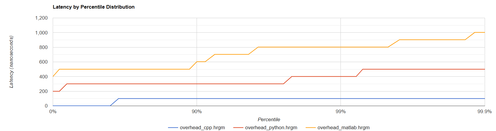
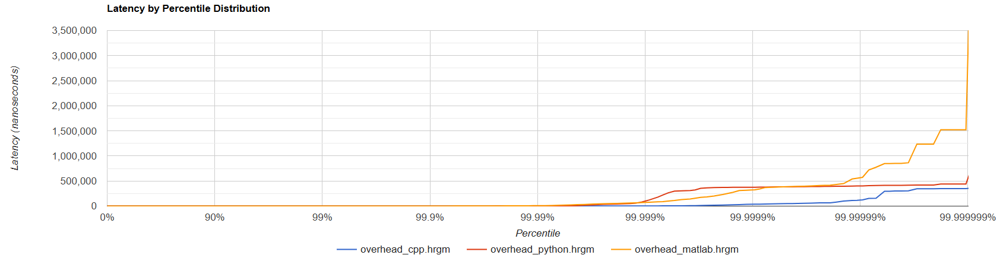

*Text Representation (.hrgm)*

[source,text]
----
       Value     Percentile TotalCount 1/(1-Percentile)

        1.00 0.000000000000   61643852           1.00
        1.00 0.100000000000   61643852           1.11
        1.00 0.200000000000   61643852           1.25
        1.00 0.300000000000   61643852           1.43
         ...                       ...            ...
   350207.00 0.999999988079   99999999    83886080.31
   350207.00 0.999999989569   99999999    95869805.31
   364543.00 0.999999991059  100000000   111848106.39
   364543.00 1.000000000000  100000000
#[Mean    =        39.18, StdDeviation   =       117.22]
#[Max     =    364543.00, Total count    =    100000000]
#[Buckets =           35, SubBuckets     =          256]
----

=== Recorded Intervals (.hlog)

The `.hlog` format stores raw interval histograms with start/end timestamps to analyze latency characteristics over time. These can be loaded into Azul's https://github.com/HdrHistogram/HistogramLogAnalyzer[HistogramLogAnalyzer].

The recording is done on a background thread with a low-overhead https://gist.github.com/giltene/b3e5490c2d7edb232644[WriterReaderPhaser] for flipping buffers.

[source,python]
----
import hebi_charts
recorder = hebi_charts.HdrHistogramRecorder(frequency=1)
hdrHistogram = recorder.add_trace("python")
recorder.start_recording("loop_python.hlog")
for _ in range(100_000_000):
    hdrHistogram.tic_toc()
recorder.stop_recording()
----

// *Azul HistogramLogAnalyzer*
//
// image::docs/images/HdrHistogram_hlog.png[align="center"]

== Experimental Features

The below features are experimental and are likely to change API in the future.

=== Embedding Snapshots

Some UI frameworks do not support fast charts or 3D elements, so we are testing ways to render HEBI Charts windows off-screen and embed them as streaming images into other UI frameworks like Qt or Wx.

The `ImageStream` API provides a triple-buffered pixel buffer that is stable between calls. The pixels need to be copied or wrapped by the user in a format that the target framework understands.

[source,python]
----
import hebi_charts
window = hebi_charts.GridWindow()
snapshot = window.create_image_stream(pixel_format=PixelFormat.BGRA_PRE)
window.show_off_screen()

# The buffer provides a zero-copy access to the raw pixels that
# is guaranteed to be stable until the next try_get_next() call
def poll_loop():
    if snapshot.try_get_next():
        size = snapshot.width * snapshot.height * snapshot.channels
        buffer = snapshot.buffer

# Map user input on the static image
window.dispatch_mouse_event(...)
----

=== Video Recording

For high-fidelity experiment exports, we provide a multi-threaded recording pipeline. To keep the core library lightweight and to avoid platform-specific pitfalls, frames are initially stored as `.png` sequences with timing metadata that can be converted to video using a local FFMpeg installation. The API provides appropriate FFMpeg commands for different output formats.

[source,python]
----
import time
import hebi_charts

# Render 1080p resolution at 2x scale for 4K video output
hebi_charts.Runtime.set_option(hebi_charts.RuntimeOption.DPI_SCALE, "2.0")
window = hebi_charts.GridWindow(size=(1920,1080))
window.show()

# Record the animation
stream = window.create_image_stream(recorder_threads=8)
stream.start_recording("video", overwrite=True)
while window.is_showing():
    time.sleep(1e-3)
record = stream.stop_recording()

# Convert to ffmpeg
print(record) # statistics on frame rate, skipped frames, etc.
print(record.get_ffmpeg_command(hebi_charts.VideoOutputFormat.H264))
print(record.run_ffmpeg(hebi_charts.VideoOutputFormat.H264, delete_directory=True))
----
