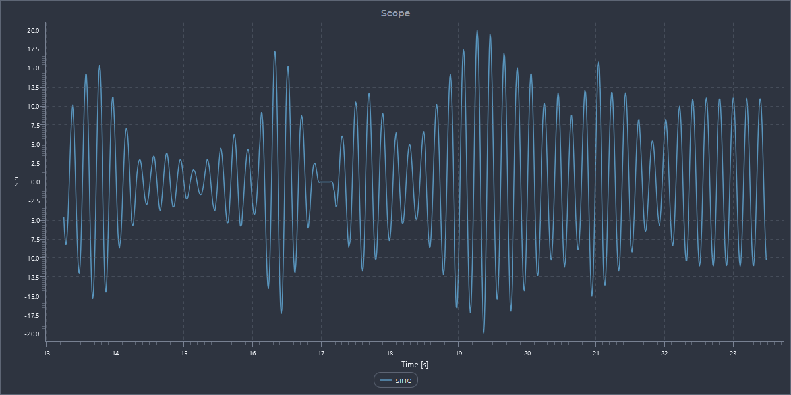

= HEBI Charts - Python

This directory contains the HEBI Charts examples for link:https://www.python.org/[Python]. For more information about the library, check the main link:../Readme.adoc[Readme].

== Installation

HEBI Charts provides a zero-configuration setup via link:./hebi_charts/hebi_charts.py[hebi_charts.py], which automatically fetches platform-specific binaries and manages them in a shared local system cache upon running examples. A dedicated native `pip` package distribution is currently in development.

While no external dependencies are required for base functionality, https://pypi.org/project/numpy/[NumPy] is needed for bulk array methods, with a native pip package currently in development.

// ======= sections that are the same across all language =======

== Example 01 - Random Walk

Introductory example showing a continuously updating non-blocking random walk.

image::../docs/images/ex01_python_randomwalk.png[align="center"]

== Example 02 - Sine Wave

Interactive demo of a continuously updating sine wave utilizing control panel sliders.

== Example 03 - Robot 3d

An interactive 2D and 3D telemetry dashboard showing a robot. Drag the joint sliders to manipulate the kinematic tree in real-time.

image::../docs/images/ex03_python_robot_3d.png[align="center"]

== Example 04 - Latency Profile

An execution profile application comparing language-specific `sleep` mechanisms with the built-in tiered high-accuracy (`sleep > yield > spin`) timer mechanism. Drag the horizontal line cursor to manipulate the sleep target dynamically.

image::../docs/images/ex04_python_latency.png[align="center"]

== Example 05 - PID Controller Simulation

An interactive classroom tuning sandbox that lets students explore the relationship between PID gains and a simulated physical Mass-Spring-Damper system.

image::../docs/images/ex05_python_pid_simulation.png[align="center"]